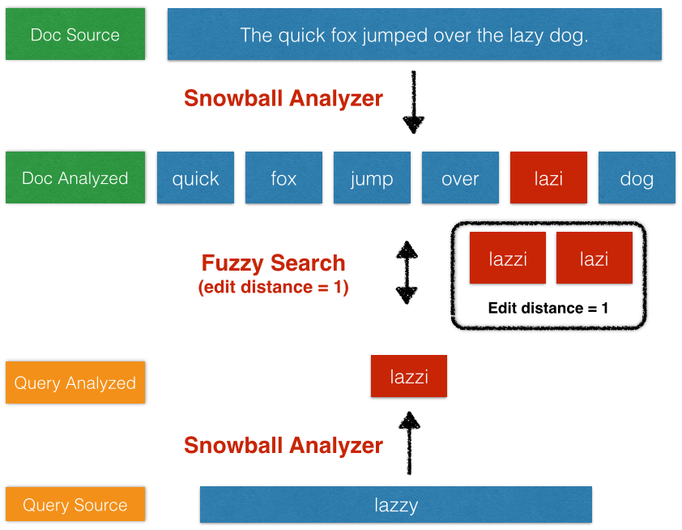

[](https://www.gnu.org/licenses/gpl-3.0)

# elasticsearch7-ngrams-fuzzy-shingles-stemming-workshop

* references
    * ngram
        * https://www.elastic.co/guide/en/elasticsearch/reference/current/analysis-ngram-tokenizer.html
        * https://qbox.io/blog/an-introduction-to-ngrams-in-elasticsearch
        * https://www.elastic.co/guide/en/elasticsearch/reference/current/analysis-edgengram-tokenizer.html
        * https://medium.com/@ashishstiwari/what-should-be-the-value-of-max-gram-and-min-gram-in-elasticsearch-f091404c9a14
        * https://kb.objectrocket.com/elasticsearch/how-to-implement-autocomplete-with-edge-n-grams-in-elasticsearch
    * shingles
        * https://www.elastic.co/guide/en/elasticsearch/reference/current/search-as-you-type.html
        * https://www.elastic.co/guide/en/elasticsearch/reference/current/analysis-shingle-tokenfilter.html
        * https://www.elastic.co/guide/en/elasticsearch/reference/current/index-phrases.html
        * https://www.elastic.co/blog/searching-with-shingles
    * stemming
        * https://www.elastic.co/guide/en/elasticsearch/reference/current/stemming.html#stemming
        * https://www.elastic.co/guide/en/elasticsearch/reference/current/analysis-stemmer-tokenfilter.html
        * https://www.elastic.co/guide/en/elasticsearch/reference/current/analysis-porterstem-tokenfilter.html
        * https://www.elastic.co/guide/en/elasticsearch/reference/current/analysis-snowball-tokenfilter.html
    * fuzzy
        * https://en.wikipedia.org/wiki/Levenshtein_distance
        * https://www.elastic.co/guide/en/elasticsearch/reference/current/query-dsl-fuzzy-query.html
        * https://www.elastic.co/blog/found-fuzzy-search
        * https://kb.objectrocket.com/elasticsearch/how-to-use-fuzzy-query-matches-in-elasticsearch
        * https://dev.to/hernamvel/understanding-and-tuning-fuzzy-queries-in-elasticsearch-by-example-1ci3
        * https://medium.com/@neelambuj2/an-approach-to-highly-intuitive-fuzzy-search-in-elasticsearch-with-typo-handling-exact-matches-a79a795d36f8
        * https://blog.mimacom.com/autocomplete-elasticsearch-part1/
    * suggester
        * https://www.elastic.co/guide/en/elasticsearch/reference/current/search-suggesters.html
        * https://www.elastic.co/guide/en/elasticsearch/reference/current/search-suggesters.html#completion-suggester
        
# introduction
* computers can't comprehend natural language
* searching natural language is inherently imprecise
* Lucene is composed of many text processing tools
    * each tool - heuristic, an algorithmic shortcut in lieu of true linguistic comprehension
    * example: prefix query type is very basic 
        * simply matches the beginning letters of words
    * example: Fuzzy queries - somewhere in the middle in terms of sophistication 
        * find words that need at most a certain number of 'edits', to match the query
    * example: Snowball stemmer and the Metaphone phonetic analyzer, are quite sophisticated
        * mimic grammatical and phonetic aspects of language
    * example: autocomplete functionality (other names: search as you type, type-ahead search)

* hierarchy overview

    | Method                                  |  Difficulty  |
    | --------------------------------------- | ------------ |
    | Prefix and Match Phrase Prefix Query    |     Easy     |
    | Index-Time Search-as-You-Type           | Intermediate |
    | Completion Suggester                    |   Advanced   |


* We have to distinguish between
  * Prefix Query
  * Match Phrase Prefix Query
  * The Prefix Query goes on not analyzed text.
    * works only on not analyzed text. Therefore we have to use the keyword text field of name
    * Now I use the prefix Eli, and I get only Elisabeth as a result. What if this was a simple typo and initially I 
    was searching for Elvis? You can see the limit of a Prefix Query here. It allows no fuzziness.
  * The Match Phrase Query is a full-text search and therefore analyzes text.
    * 

## ngram
* splitting a token into multiple subtokens
* sliding window that moves across the word - continuous sequence of characters of the specified length
* example
    * token: michal
    * 1-grams: m, i, c, h, a, l
    * bigrams: mi, ic, ch, ha, al
    * trigrams: mic, ich, cha, hal
* how it could boost searching
    * incorrectly spelled word: “mihal”
    * use fuzzy query (specify an edit distance for words to check matches)
        * will be discussed later
    * use ngrams
        * Bigrams for “michal”: mi ic ch ha al
        * Bigrams for “mihal”: mi ih ha al
        * may be drawback: more words than intended will match the original
* use-case
    * analyze text when the language is not known beforehand
        * or handle multiple languages with a single analyzer
    * analyze text when the language combines words in different manner than other European languages 
        * no spaces between words
        * have long compound words, like German

### edge ngrams
* no user will search for “Database” using the “ase” chunk of characters 
    * that’s where edge n-grams come into play 
    * edge n-grams = prefixes
* example
    * token: michal
    * edge n-grams: m, mi, mic, mich, micha, michal
* helpful for searching words with prefix
    * prefix query is time consuming
* for many applications, only ngrams that start at the beginning of words are needed
* index vs search analyzer
    * standard approach: same analyzer at index time and at search time 
    * in the case of the edge ngram tokenizer - the advice is different 
        * ensure that prefixes are available for matching in the index - edge_ngram tokenizer at index time
        * at search time, just search for the terms the user has typed in - standard tokenizer at search time
    * good practice to set upper limit
        * for example if search for text with `length > 8` - full text search instead of terms 
    
* GET /test_index/doc/1/_termvector?fields=text_field
    * to show generated ngrams
    * `min_gram`
        * the smallest ngrams you want to generate
        * defaults: 1
    * `max_gram`
        * the largest ngrams you want to generate
        * defaults: 2
    ```
          "analysis": {
             "filter": {
                "ngram_filter": {
                   "type": "nGram",
                   "min_gram": 4,
                   "max_gram": 4
                }
             }
    ```

* A common use of ngrams is for autocomplete, and users tend to expect to see suggestions after only a few keystrokes
* Generating a lot of ngrams will take up a lot of space and use more CPU cycles for searching, so you should be careful not to set mingram any lower, and maxgram any higher, than you really need
* autocomplete implemented - TL;DR: General-purpose Autocomplete
    * https://www.elastic.co/guide/en/elasticsearch/reference/current/analysis-edgengram-tokenizer.html
        * Below is an example of how to set up a field for search-as-you-type
    * https://kb.objectrocket.com/elasticsearch/how-to-implement-autocomplete-with-edge-n-grams-in-elasticsearch
        * grocery shop
* compare with: https://www.elastic.co/guide/en/elasticsearch/reference/current/search-suggesters.html#completion-suggester

## shingles
* https://www.elastic.co/guide/en/elasticsearch/reference/current/search-as-you-type.html
* `index-phrases` option on a text field
    * If enabled, two-term word combinations (shingles) are indexed into a separate field.
    * This allows exact phrase queries (no slop) to run more efficiently, at the expense of a larger index
    
* it creates combinations of tokens as a single token
    * the sentence "please divide this sentence into shingles" might be tokenized into shingles 
    * "please divide", "divide this", "this sentence", "sentence into", and "into shingles"

* The shingles token filter is basically ngrams at
  the token level instead of the character level
* so if you had the text “foo bar baz”
    * min_shingle_size of 2 and a max_shingle_size of 3
    * foo, foo bar, foo bar baz, bar, bar baz, baz
* This is because by default the shingles
  filter includes the original tokens
* I'm a fan of shingles because they give you both exact-match and phrase matching. 
    * An exact match will hit all the shingled tokens and boost the score appropriately, while other 
    queries can still hit parts of the phrase. 
    * And since shingles are stored as tokens in the index, their TF-ID is calculated and rarer phrase 
    matches enjoy a bigger score boost than more common phrases.

* give you both exact-match and phrase matching. An exact match will hit all the shingled tokens and boost the score 
appropriately, while other queries can still hit parts of the phrase
* Shingles effectively give you the ability to pre-bake phrase matching. 
    * By building phrases into the index, you can avoid creating phrases at query time and save 
    some processing time/speed
* The downside is that you have larger indices

## stemming
* stemming is the act of reducing a word to its base or root word
* This is extremely handy when searching because it means you’re able to match words sharing the 
root or stem of the word
* If the word is “administrations,” the root of the word is “administr.”
    * This allows you to match all of the other roots for this word, like “administrator,” “administration,” 
    and “administrate.” 
* Stemming is a powerful way of making your searches more flexible than rigid exact matching.
* Stemming is the process of reducing a word to its root form. 
    * This ensures variants of a word match during a search.
* In some cases, the root form of a stemmed word may not be a real word. 
    * For example, jumping and jumpiness can both be stemmed to jumpi

* Algorithmic stemmers, which stem words based on a set of rules
    * Algorithmic stemmers apply a series of rules to each word to reduce it to its root form. 
    * For example, an algorithmic stemmer for English may remove the -s and -es prefixes from 
    the end of plural words
    * Algorithmic stemmers have a few advantages:
        * They require little setup and usually work well out of the box.
        * They use little memory.
        * They are typically faster than dictionary stemmers.
    * most algorithmic stemmers only alter the existing text of a word. 
        * This means they may not work well with irregular words that don’t contain their root form, such as:
            * be, are, and am
            * mouse and mice
            * foot and feet
    * types
        * stemmer, which provides algorithmic stemming for several languages, some with additional variants.
            * uses the porter stemming algorithm for English
        * kstem, a stemmer for English that combines algorithmic stemming with a built-in dictionary.
        * porter_stem, our recommended algorithmic stemmer for English.
            * based on the Porter stemming algorithm
            * tends to stem more aggressively
        * snowball, which uses Snowball-based stemming rules for several languages
            * using a Snowball-generated stemmer
* Dictionary stemmers, which stem words by looking them up in a dictionary
    * look up words in a provided dictionary, replacing unstemmed word variants with stemmed words 
    from the dictionary
    * stemmers are well suited for
      * Stemming irregular words
        * Discerning between words that are spelled similarly but not related conceptually, such as:
      * organ and organization
        * broker and broken
    * algorithmic stemmers typically outperform dictionary stemmers. 
        * This is because dictionary stemmers have the following disadvantages:
            * Dictionary quality
                * A dictionary stemmer is only as good as its dictionary. 
                * To work well, these dictionaries must include a significant number of words, be updated 
                regularly, and change with language trends. 
                * Often, by the time a dictionary has been made available, it’s incomplete and some of its 
                entries are already outdated.
            * Size and performance
                * Dictionary stemmers must load all words, prefixes, and suffixes from its dictionary into 
                memory. 
                * This can use a significant amount of RAM. 
                * Low-quality dictionaries may also be less efficient with prefix and suffix removal, which 
                * can slow the stemming process significantly.
### Algorithmic stemming
* https://www.elastic.co/guide/en/elasticsearch/reference/current/analysis-snowball-tokenfilter.html
* Algorithmic stemming is applied by using a formula or set of rules for each token in
  order to stem it
* the snowball filter, the porter stem filter, and the kstem filter
    * differences in how aggressive they are with regard to stemming
    * By aggressive we mean that the more aggressive stemmers chop off more
      of the word than the less aggressive stemmers
### Stemming with dictionaries
* https://www.elastic.co/guide/en/elasticsearch/reference/current/analysis-hunspell-tokenfilter.html
* Sometimes algorithmic stemmers can stem words in a strange way because they don’t
  know any of the underlying language
* Because of this, there’s a more accurate way to
  stem words that uses a dictionary of words
* hunspell token filter, combined with a dictionary, to handle the stemming
    * quality of the stemming is directly related to the quality of the dictionary that you use.
    * The stemmer will only be able to stem words it has in the dictionary
    
## fuzzy
* the Levenshtein distance between two words is the minimum number of single-character edits (insertions, deletions or 
substitutions) required to change one word into the other

* vs ngrams
    * After introducing typo’s , document containing “shoiab” will not be found because the search term 
    doesn’t matches any indexed token.
    * Solution: Using fuzziness

* fuzzy-query
    * Returns documents that contain terms similar to the search term, as measured by a Levenshtein edit distance
    * An edit distance is the number of one-character changes needed to turn one term into another
        * Changing a character (box → fox)
        * Removing a character (black → lack)
        * Inserting a character (sic → sick)
        * Transposing two adjacent characters (act → cat)
    * fuzzy query creates a set of all possible variations, or expansions, of the search term within a specified edit 
    distance
        * fuzzy query: The elasticsearch fuzzy query type should generally be avoided. Acts much like a term query. 
        Does not analyze the query text first
        * The query then returns exact matches for each expansion
    * parameters
        * value
            * (Required, string) Term you wish to find in the provided <field>.
        * fuzziness
            * (Optional, string) Maximum edit distance allowed for matching.
            * 2 - maximum allowed Levenshtein Edit Distance (or number of edits)
                * Larger differences are far more expensive to compute efficiently and are not processed by Lucene
            * AUTO
                * 0..2 - Must match exactly
                * 3..5 - One edit allowed
                * `>5` - Two edits allowed
        * max_expansions (Optional, integer) Maximum number of variations created. Defaults to 50.
        * prefix_length (Optional, integer) Number of beginning characters left unchanged when creating expansions. Defaults to 0.
* match-query
    * fuzziness(Optional, string) Maximum edit distance allowed for matching
* misspellings problems
* Damerau-Levenshtein distance formula is a modification of the classic Levenshtein distance formula, altering it by 
adding transposition as a valid operation.
* The utility of transpositions can be seen in the case of comparing the strings 'aex' and 'axe'. 
    * When using the classic Levenshtein distance formula, 'aex' is not one, but two edits away; the 'e' 
    must be deleted, after which a new 'e' is inserted in the proper place, while in Damerau-Levenshtein, 
    a single operation, swapping the 'e' and the 'x', suffices
    *  using classic Levenshtein would mean that 'aex' is as far away from 'axe' as 'faxes' is; an example showing why 
    Damerau-Levenshtein makes greater intuitive sense in most cases
* This also means that if using say, a snowball analyzer, a fuzzy search for 'running', will be stemmed 
to 'run', but will not match the misspelled word 'runninga', which stems to 'runninga', because 
'run' is more than 2 edits away from 'runninga'. This can cause quite a bit of confusion, and for 
this reason, it often makes sense only to use the simple analyzer on text intended for use with 
fuzzy queries, possibly disabling synonyms as well
    

* The problem is, sometimes users make mistakes. If you’re only querying for exact matches, simple typos 
and spelling errors can lead to empty results– not an ideal user experience

* grocery store example

* example for fuzziness
    * doc1: "i will marry you because I love you"
    * doc2: "i will live with harry"
    * doc2: "i'm sorry for your loss"
    * "value": "harry", "fuziness": 1
        * Levenshtein('harry', 'marry') = 1 in doc1
        * Levenshtein('harry', 'harry') = 0 in doc2
        * Levenshtein('harry', 'sorry') = 2 in doc2

* often combined with prefix search
    ```
    GET employees/_search
    {
      "query": {
        "bool": {
          "should": [
            { "prefix": { "name.keyword": "Eli" } },
            { "fuzzy": { "name.keyword": { "value": "Eli", "fuzziness": 2, "prefix_length": 0 } } }
          ]
        }
      }
    }
    ```
* Queries like the term prefix or fuzzy queries are low-level queries that have no analysis phase
    * important to remember that the term query looks in the inverted index for the exact term only
        * lowercase cannot fild with uppercase

### suggesters
* Suggests similar looking terms based on a provided text by using a suggester. 
* Parts of the suggest feature are still under development.
```
POST twitter/_search
{
  "suggest" : {
    "my-suggestion" : {
      "text" : "tring out Elasticsearch",
      "term" : {
        "field" : "message"
      }
    }
  }
}
```
* term-suggester
    * suggests terms based on edit distance
    * suggested terms are provided per analyzed suggest text token
    * params
        * max_edits
        * prefix_length
        * string_distance
* completion-suggester
    * provides auto-complete/search-as-you-type functionality
    * It is not meant for spell correction or did-you-mean functionality like the term suggester
    * uses data structures that enable fast lookups, but are costly to build and are stored in-memory
    * supports fuzzy queries